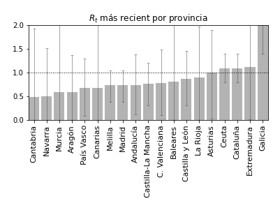
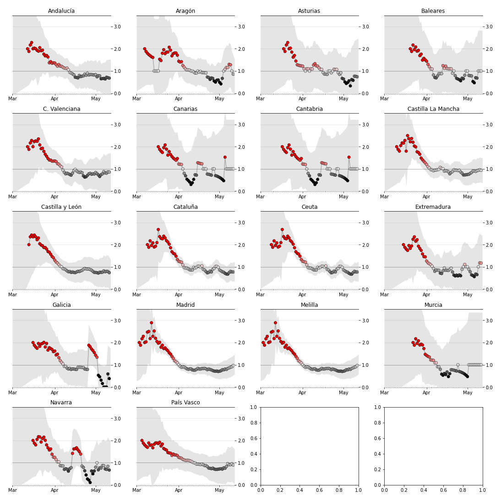

# 🦠
# La reproducción de COVID19 en España
Un proyecto de [Pedro](htps://ppinera.es) y [María José](https://www.linkedin.com/in/mariajosesalmeron/).
#### Datos actualizados a fecha de 13 de Mayo

Cuando escuchamos sobre el estado de la pandemia a través de medios de comunicación o del gobierno, la mayoría de datos que se muestran son absolutos, como por ejemplo el número de afectados o fallecidos. Aunque son datos interesantes, su carácter absoluto los hace meramente informativos por lo que **no deberían ser una referencia a la hora de adoptar o ajustar medidas de confinamiento.**

Para saber como actuar de forma efectiva es **más útil conocer y medir mediante estimaciones el comportamiento del virus en el tiempo**. En otras palabras, como este se reproduce y el impacto que tiene en la población. En términos matemáticos hablaríamos del numero de reproducción efectivo o Rt.

Cuando este valor es superior a 1.0, indica que en el virus tiene la capacidad de reproducirse y que por lo tanto se debería aplicar confinamiento. A mayor es el número, más capacidad de reproducción tiene el virus. Cuando el valor es próximo a 1.0, esto indica que el virus empieza a estar bajo control, pero que nada lo previene de volver a reproducirse. Lo interesante es conseguir que el número tienda a 0 ya que eso indica que la capacidad reproductora del virus se está delimitando.

Inspirado en [este proyecto](http://systrom.com/blog/the-metric-we-need-to-manage-covid-19/) de [Kevin Systrom](https://twitter.com/kevin), co-fundador de Instagram, y su [adaptación](https://github.com/tcamin/covid19-italy-Rt) a Italia, realizada por [Tomas Camin](https://github.com/tcamin), en esta página web **mostramos la tasa de reproducción efectiva (Rt) del COVID-19 por comunidad autónoma en España**, generada a partir del histórico de fallecidos e infectados aplicando el método [Bettencourt & Ribeiro](https://journals.plos.org/plosone/article?id=10.1371/journal.pone.0002185).

<Message title="Nota" description={`Aunque como ciudadano tu obligación es cumplir con las medias impuestas por el estado, **estás en el derecho de tener acceso a información rigurosa** que va más allá de hablar en términos de picos y curvas. Confiamos en que las decisiones del gobierno están respaldadas por rigurosos análisis a los que desafortunadamente no tenemos acceso.`}/>

<Message title="Datos" description={`Los datos utilizados para realizar este análisis han sido obtenidos del dataset de [Datadista](https://github.com/datadista/datasets/tree/master/COVID%2019). Por su parte, tanto el código para procesar los datos, como el código fuente de este sitio web están disponibles en el siguiente [repositorio](https://github.com/pepibumur/covid19-spain).`}/>

## Datos

### Comunidades autónomas ordenadas en función de su tasa

El gráfico organiza las comunicades autónomas en función de la tasa de reproduccion del virus a fecha del 13 de Mayo. En aquellas comunidades situadas a la izquierda, es decir con una tasa de reproducción inferior, el virus está más controlado que en aquellas que aparecen a la derecha del gráfico.

### Tasa de reproducción efectiva por comunidad autónoma

Las gráficas muestran la evolución de la tasa de reproducción del virus por comunidad autónoma. Como se trata de una estimación, los gráficos muestran una zona gris que engloba los rangos entre los cuales podría oscilar.

## Referencias

El contenido de los siguientes enlaces han sido de gran utilidad para el desarrollo de este proyecto:

- [Basic reproduction number](https://web.stanford.edu/~jhj1/teachingdocs/Jones-on-R0.pdf)
- [Lockdown strategies](https://www.nytimes.com/interactive/2020/us/coronavirus-stay-at-home-order.html)
- [Manage COVID-19](http://systrom.com/blog/the-metric-we-need-to-manage-covid-19/)
- [Rt analysis in Italy](https://github.com/tcamin/covid19-italy-Rt)
- [Angela Merkel uses science background in coronavirus explainer](https://www.youtube.com/watch?v=22SQVZ4CeXA)
